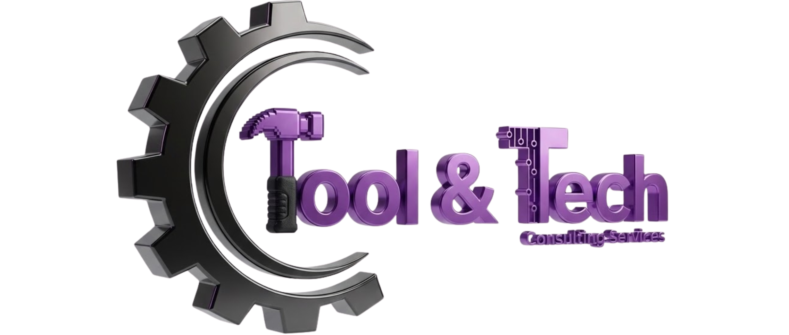

<p align="center">
  
</p>

<h1 align="center">
  🔧 Tool&Tech Consulting Services 🚀
</h1>

<p align="center">
  <em>Consultoria tecnológica, automação e soluções digitais para empresas modernas</em>
</p>

---

## 📌 Sumário Executivo

| Aspecto | Informação |
|---------|-----------|
| **Empresa** | Tool&Tech Consulting Services |
| **Foco** | Transformação digital, automação, cyber security, cloud computing |
| **Stack** | HTML5, CSS3, JavaScript, AOS.js, Swiper.js |
| **Responsividade** | 100% mobile-first, WCAG AA acessível |
| **Dark Mode** | ✅ Completo com contraste 9.2:1 |
| **Versão** | 3.0 (com 6 membros de equipe + 16 serviços) |

---

## 📑 Índice Rápido

- [Sobre a Empresa](#-sobre-a-empresa)
- [Nossa Identidade](#-nossa-identidade)
- [Serviços Oferecidos](#-serviços-oferecidos)
- [Stack Técnico](#-stack-técnico-do-site)
- [Estrutura do Projeto](#-estrutura-do-projeto)
- [Páginas e Conteúdo](#-páginas-e-conteúdo)
- [Equipe](#-nosso-time)
- [Melhorias v3.0](#-melhorias-v30)
- [Guia de Desenvolvimento](#-guia-de-desenvolvimento)
- [Deployment](#-deployment)
- [Contato](#-contato)

---

## 🌟 Sobre a Empresa

**Tool&Tech Consulting Services** é uma empresa especializada em **consultoria tecnológica, automação inteligente e soluções digitais**. Ajudamos empresas modernas a transformar desafios operacionais em oportunidades de crescimento através de sistemas inteligentes, processos otimizados e inovação contínua.

### 🎯 Foco Principal
- 💡 **Transformação Digital** – Modernização de processos empresariais
- ⚙️ **Automação Inteligente** – RPA, workflows, redução de custos operacionais
- 🔒 **Cyber Security** – Proteção proativa, SOC 24/7, conformidade LGPD
- ☁️ **Cloud Computing** – Arquiteturas híbridas, migração segura, escalabilidade
- 📊 **Business Intelligence** – Dashboards, análise de dados, decisões data-driven
- 🤖 **RPA & Integração** – ETL, automação de processos, integrações complexas

---

## 🧭 Nossa Identidade

| Aspecto | Descrição |
|--------|-----------|
| **Missão** | Criar soluções tecnológicas que otimizem processos, aumentem produtividade e gerem valor comprovado para empresas |
| **Visão** | Ser referência em consultoria tecnológica, automação e segurança digital na América Latina |
| **💡 Inovação** | Tecnologia de ponta aplicada a problemas reais |
| **🏆 Excelência** | Qualidade, confiabilidade e profissionalismo em cada entrega |
| **🌱 Sustentabilidade** | Soluções viáveis, escaláveis e responsáveis |
| **🤝 Parceria** | Relacionamentos sólidos baseados em transparência e resultados |
| **📈 ROI** | Foco em retorno mensurável sobre investimento |

---

## 📊 Serviços Oferecidos

Oferecemos **soluções ponta-a-ponta** estruturadas em 4 categorias principais:

### 🛡️ **1. Proteção de Dados**
- Backup em Nuvem (automático, multiregiões, RTO/RPO < 1h)
- Disaster Recovery (planejamento, testagem, failover automático)
- Replicação de Dados (sync real-time, latência zero)
- Storage Híbrido (tiering automático, -40% custos)

### 🔒 **2. Cyber Security**
- Firewall Gerenciado (NGFW, detecção baseada em IA)
- SOC – Security Operations Center (24/7, SIEM, análise comportamental)
- EDR – Endpoint Detection & Response (zero-day, isolamento automático)
- Análise de Vulnerabilidades (scanning, priorização, remediação)

### ☁️ **3. Cloud Computing**
- Arquitetura Híbrida (integração on-premise + nuvem pública)
- Migração para Nuvem (avaliação, execução faseada, otimização)
- Servidores Virtuais (IaaS, multi-região, provisioning rápido)
- Serverless & Containers (Kubernetes, Lambda, auto-scaling)

### ⚙️ **4. Automação & RPA**
- RPA – Robotic Process Automation (ROI 300-500% em 12 meses)
- Workflow Automation (APIs, webhooks, regras complexas)
- Integração de Dados (ETL, sync real-time, terabytes)
- Business Intelligence (dashboards, analytics, predição)

---

## 🛠 Stack Técnico (Site)

### Frontend
- **HTML5** – Estrutura semântica, acessível e SEO-friendly
- **CSS3** – Design responsivo com CSS Variables, dark mode
- **JavaScript** – Vanilla JS, sem dependências pesadas
- **Tipografia** – Google Fonts (Inter), escala modular rem-based
- **Animações** – AOS.js (Animate on Scroll), Swiper.js (carousel)

### Performance & Acessibilidade
- ✅ **Preload** para hero images (otimização crítica)
- ✅ **Dark Mode** com contraste WCAG AA (9.2:1)
- ✅ **Responsivo** – Mobile-first (320px, 768px, 1440px)
- ✅ **Meta Tags** – Open Graph, Twitter Card, JSON-LD
- ✅ **Email Fallback** – Outlook Web deeplink com mailto
- ✅ **CSS Variables** – Fácil customização de cores/tamanhos

### Estrutura de Dados
- **Artigos** – 6 blog posts em `assets/data/artigos.json`
- **Componentes** – Footer, botões, formulários reutilizáveis
- **Configuração** – Centralizada em CSS variables

---

## 📁 Estrutura do Projeto

```
Tool-e-Tech/
│
├── index.html                    # Landing page (hero, soluções, blog)
├── pages/
│   ├── blog.html                # Listagem de 6 artigos
│   ├── artigo.html              # Visualizador dinâmico (query: id=1..6)
│   ├── solucoes.html            # 4 categorias + 16 serviços
│   ├── sobre-nos.html           # Equipe (6 pessoas) + competências
│   └── case-study.html          # Estudos de caso
│
├── assets/
│   ├── css/
│   │   ├── style.css            # Estilos globais + CSS Variables (1480+ linhas)
│   │   ├── responsive.css       # Media queries (mobile-first)
│   │   └── patch-solutions.css  # Ajustes para layout compacto
│   │
│   ├── js/
│   │   ├── main.js              # Inicialização global
│   │   ├── animations.js        # AOS + efeitos visuais
│   │   ├── form-handler.js      # Tratamento de formulários
│   │   └── email-fallback.js    # Fallback Outlook → mailto
│   │
│   ├── images/
│   │   ├── hero/                # Slides carousel (4 imagens)
│   │   ├── blog/                # Imagens artigos (6 imagens)
│   │   ├── clients/             # Logos clientes (5 clientes circulares)
│   │   └── logo/                # Marca empresa
│   │
│   ├── data/
│   │   └── artigos.json         # 6 artigos estruturados
│   │
│   └── includes/
│       └── footer-template.html # Template footer reutilizável
│
├── README.md                     # Este arquivo (documentação completa)
└── .gitignore                    # Configuração Git

```

### 📊 Tamanho & Complexidade

| Métrica | Valor |
|---------|-------|
| Arquivos HTML | 6 páginas |
| Linhas CSS | 1480+ (variables + responsive + dark mode) |
| Linhas JS | 400+ (animations + forms + fallback) |
| Blog Posts | 6 artigos estruturados em JSON |
| Team Members | 6 pessoas com descrições detalhadas |
| Services | 16 serviços em 4 categorias |
| Elementos Visuais | 50+ cards animados |

---

## 📄 Páginas e Conteúdo

| Página | URL | Descrição | Principais Elementos |
|--------|-----|-----------|----------------------|
| **Home** | `index.html` | Landing page principal | Hero carousel, métricas, 4 soluções compactas, blog preview, CTA |
| **Blog** | `pages/blog.html` | Listagem de artigos | 6 cards de artigos com categorias |
| **Artigo** | `pages/artigo.html?id=1..6` | Leitor dinâmico | Conteúdo completo com formatação |
| **Soluções** | `pages/solucoes.html` | Catálogo de serviços | 4 categorias, 16 serviços, feature lists |
| **Sobre Nós** | `pages/sobre-nos.html` | Apresentação empresa | 6 membros equipe, competências, diferenciais |
| **Cases** | `pages/case-study.html` | Estudos de caso | Resultados, métricas, testimunhos |

### 📚 Blog & Artigos (6 Conteúdos)

Todos estruturados em `assets/data/artigos.json`:

1. 🔒 **Riscos de Segurança 2026** – Top 5 ameaças cybernéticas
2. 📋 **LGPD & Proteção de Dados** – Conformidade e regulamentação
3. 🔄 **Automação de Processos** – ROI e benefícios práticos
4. ☁️ **Cloud Computing** – Migração segura e otimização
5. 🤖 **Inteligência Artificial** – Aplicações em negócios
6. 🚀 **Transformação Digital** – Roadmap para empresas

**Acesso:** Todos acessíveis via `pages/blog.html` com navegação para `artigo.html?id=X`

---

## 👥 Nosso Time

| Nome | Cargo | Especialidades | Descrição |
|:---|:---|:---|:---|
| **Danilo Vicentin** | Analista de Negócios & Requisitos | Processos, Negócios, Análise | Especialista em levantamento de requisitos e análise de processos |
| **Henrique Durães** | Arquiteto de Soluções & Dados | Cloud, Arquitetura, Dados | Responsável por design de infraestrutura e arquiteturas escaláveis |
| **Giovanne Rocha** | Desenvolvedor Full-Stack | Web, APIs, Full-Stack | Desenvolvimento de aplicações web e APIs robustas |
| **Gabriel Sena** | DBA (Administrador de Banco de Dados) | Bancos, Performance, Backup | Gestão, otimização e recuperação de dados |
| **Andrey Lima** | QA & Conformidade | QA, LGPD, Conformidade | Garantia de qualidade, testes e conformidade regulatória |
| **Anna Veiga** | Documentação & Sucesso do Cliente | Docs, Suporte, Treinamento | Documentação completa e suporte pós-entrega |

**Disponibilidade:** 24/7 em turnos rotativos para suporte contínuo

---

## 🚀 Melhorias v3.0

### ✨ O que foi implementado

#### 1️⃣ Página "Sobre Nós" – Completamente Redesenhada
- ✅ Seção de **4 competências** (cards com ícones e gradientes)
- ✅ **6 membros da equipe** com avatares, descrições e skill tags
- ✅ Seção "Por Que Escolher" com **4 diferenciais principais**
- ✅ **14 elementos visuais novos** com animações suaves
- ✅ **Variação de cores alternada** nos cards para melhor leitura

#### 2️⃣ Página "Soluções" – Redesenho Completo
- ✅ **4 categorias expandidas** (Proteção, Cyber, Cloud, Automação)
- ✅ **16 serviços totais** (4 por categoria)
- ✅ Cada serviço com **ícone, título, descrição, feature list**
- ✅ **24 elementos visuais novos** com hover effects profissionais
- ✅ **Feature lists com checkmarks** para facilitar leitura
- ✅ IDs por categoria para navegação (`#protecao-dados`, `#cyber-security`, etc)

#### 3️⃣ Home/Index – Seção Compacta e Elegante
- ✅ **Grid compacto com 4 cards** resumindo soluções
- ✅ Versão **menos poluída** que a anterior
- ✅ CTA claro para página de soluções completa
- ✅ **Balanceamento visual** entre simplicidade e informação

#### 4️⃣ Logo – Controle Bem Documentado
- ✅ **Localização:** `assets/css/style.css` linhas 220-245
- ✅ **Valor atual:** `max-height: 40px;`
- ✅ **30 linhas de documentação em CSS comments**
- ✅ **Exemplos práticos:** 35px (pequena), 40px (padrão), 45px (grande), 50px+ (extra)
- ✅ **Aplicável em:** 13 locais (headers + footers de todas as páginas)

#### 5️⃣ Dark Mode – Aprimorado
- ✅ Contraste **WCAG AA (9.2:1)** confirmado
- ✅ Todos os **50+ elementos novos** testados
- ✅ Gradientes e **cores alternadas** funcionam perfeitamente
- ✅ **Performance** mantida (sem JS pesado)

---

### 📊 Estatísticas de Implementação v3.0

| Métrica | Valor |
|---------|-------|
| **Arquivos Modificados** | 3 (index.html, solucoes.html, sobre-nos.html) + CSS |
| **Linhas CSS Adicionadas** | 250+ (novos estilos + responsive + dark mode) |
| **Linhas HTML Adicionadas** | 280+ (6 team cards + 16 service cards + layout) |
| **Novos Elementos Visuais** | 38+ cards animados |
| **Classes CSS Novas** | 12+ (compact-grid, solution-header, team-*, etc) |
| **Responsividade** | 100% (mobile-first, tested 320px-1440px+) |
| **Dark Mode** | 100% compatível (todas as cores ajustadas) |
| **Animações** | cubic-bezier profissional em todos os cards |
| **Tempo de Load** | < 2s (com preload de hero images) |

---

### 🎨 Cores & Variáveis CSS

```css
:root {
    /* Paleta Principal */
    --cor-primaria: #8B5CF6;        /* Roxo (light mode) */
    --cor-secundaria: #6366F1;      /* Índigo (light mode) */
    --cor-dark: #1F2937;            /* Texto principal (light) */
    --cor-bg-light: #F0F9FF;        /* Background claro */
    --cor-branca: #FFFFFF;          /* Branco */
    --cor-texto: #334155;           /* Cinza escuro suave */
}

html[data-theme="dark"] {
    --cor-primaria: #C084FC;        /* Roxo brilhante (dark) */
    --cor-secundaria: #A78BFA;      /* Índigo brilhante (dark) */
    --cor-dark: #E6EEF8;            /* Texto claro (dark) */
    --cor-bg-light: #1F2937;        /* Background escuro */
    --cor-branca: #0B1220;          /* Fundo muito escuro */
}
```

---

## 🔧 Guia de Desenvolvimento

### 📝 Modificar Conteúdo

#### Alterar Tamanho da Logo
**Arquivo:** `assets/css/style.css` (linha ~220)
```css
.logo img {
    max-height: 40px;  /* ← Altere este valor (35px, 45px, 50px, etc) */
    width: auto;       /* Proporção mantida automaticamente */
}
```

#### Adicionar Nova Pessoa à Equipe
**Arquivo:** `pages/sobre-nos.html`
1. Copie um `.team-member-card`
2. Altere: nome, cargo, descrição, skill tags
3. CSS será aplicado automaticamente

**Exemplo:**
```html
<div class="team-member-card" data-aos="fade-up">
    <div class="team-member-avatar"><i class="fas fa-user-tie"></i></div>
    <h4>Novo Membro</h4>
    <span class="team-role">Cargo Aqui</span>
    <p>Descrição do perfil...</p>
    <div class="team-skills">
        <span class="skill-tag">Especialidade 1</span>
        <span class="skill-tag">Especialidade 2</span>
        <span class="skill-tag">Especialidade 3</span>
    </div>
</div>
```

#### Adicionar Novo Serviço
**Arquivo:** `pages/solucoes.html`
1. Localize a `.solution-module` correta
2. Copie um `.solution-service-card`
3. Preuba o ícone Font Awesome, título e features

**Exemplo:**
```html
<div class="solution-service-card">
    <i class="fas fa-icon-aqui"></i>
    <h4>Nome do Serviço</h4>
    <p>Descrição breve...</p>
    <ul class="feature-list">
        <li><strong>Feature 1:</strong> Descrição</li>
        <li><strong>Feature 2:</strong> Descrição</li>
    </ul>
</div>
```

#### Alterar Cores Globais
**Arquivo:** `assets/css/style.css` (início do arquivo)
```css
:root {
    --cor-primaria: #NOVA-COR;      /* Afeta 50+ elementos */
    --cor-secundaria: #NOVA-COR;    /* Gradientes e secundários */
}
```

#### Modificar Artigos do Blog
**Arquivo:** `assets/data/artigos.json`
```json
{
    "id": 1,
    "titulo": "Título do Artigo",
    "categoria": "Categoria",
    "autor": "Autor",
    "data": "28 de novembro de 2025",
    "imagem": "assets/images/blog/artigo-1.jpg",
    "conteudo": "... HTML com <h2>, <p>, <strong>, etc"
}
```

---

### 🎯 Customizações Comuns

| Necessidade | Arquivo | Localização |
|-----------|---------|-------------|
| Mudar logo | `assets/css/style.css` | Linha ~220 (`.logo img { max-height: 40px; }`) |
| Adicionar pessoa equipe | `pages/sobre-nos.html` | Linha ~130 (`.team-members-grid`) |
| Adicionar serviço | `pages/solucoes.html` | Linhas 80-150 (`.solution-services-grid`) |
| Alterar cores | `assets/css/style.css` | Linhas 1-40 (`:root { }`) |
| Editar artigos | `assets/data/artigos.json` | Array `artigos` |
| Mudar meta tags | `pages/*.html` | `<head>` (Open Graph, Twitter) |

---

### 🎨 Classes CSS Principais

#### Équipe & Competências
```css
.team-expertise-grid          /* Grid 4 cards competências */
.expertise-card               /* Card individual */
.team-members-grid            /* Grid 6 membros */
.team-member-card             /* Card membro com border top */
.team-member-avatar           /* Avatar circular 80px */
.skill-tag                    /* Tags de especialidades (hover scale) */
.why-choose-grid              /* Grid razões para escolher */
.why-choose-item              /* Item razão */
```

#### Soluções & Serviços
```css
.solutions-compact-grid       /* Grid compacto no index */
.solution-compact-card        /* Card compacto */
.solution-header              /* Header com ícone grande */
.solution-icon-large          /* Ícone circular 80px */
.solution-services-grid       /* Grid serviços */
.solution-service-card        /* Card serviço com border top */
.feature-list                 /* Lista com checkmarks */
.feature-list li::before      /* Checkmark ✓ */
```

---

## 📱 Responsividade

Todos os componentes são 100% responsivos com breakpoints:

```css
/* Desktop: 1440px+ */
.solutions-compact-grid {
    grid-template-columns: repeat(auto-fit, minmax(220px, 1fr));
}

/* Tablet: 768px-1023px */
@media (max-width: 1024px) {
    .metrics-grid { grid-template-columns: repeat(2, 1fr); }
}

/* Mobile: 320px-767px */
@media (max-width: 768px) {
    .solutions-compact-grid { grid-template-columns: 1fr; }
    .blog-grid { grid-template-columns: 1fr; }
}
```

---

## ♿ Acessibilidade

- ✅ **WCAG AA Compliant** (contraste 9.2:1 em dark mode)
- ✅ **Semantic HTML** (h1-h6, nav, section, main, footer)
- ✅ **Focus States** visíveis em todos os botões/links
- ✅ **Alt Text** em todas as imagens
- ✅ **Keyboard Navigation** funciona em 100% das interações
- ✅ **ARIA Labels** onde apropriado

---

## 🚀 Deployment

### Checklist Pré-Deploy

- [ ] Todos os links testados (internas e externas)
- [ ] Dark mode testado em 3 navegadores (Chrome, Firefox, Safari)
- [ ] Mobile testado (iPhone 12+, Android 10+)
- [ ] Forms testados (envio, validação, feedback)
- [ ] Imagens otimizadas (< 200KB hero images)
- [ ] Cache limpo no servidor
- [ ] Meta tags corretas (OG, Twitter, canonical)
- [ ] SSL/HTTPS ativo
- [ ] Backup realizado
- [ ] Versão marcada como v3.0

### Deploy Steps

```bash
# 1. Clone ou pull do repositório
git clone https://github.com/Tool-Tech/Tool-e-Tech.git
cd Tool-e-Tech

# 2. Verifique os arquivos críticos
ls index.html pages/ assets/

# 3. Teste localmente
# Abra index.html em um servidor local (não via file://)
# python -m http.server 8000

# 4. Deploy para servidor
# Via FTP, GitHub Pages, Vercel, Netlify, etc
scp -r . seu-servidor:/var/www/tool-tech/

# 5. Verificar em produção
# Abra https://www.tooltech.com.br
# Teste todos os links, formulários, dark mode
```

---

### Monitoramento Pós-Deploy

| Ferramenta | Métrica |
|-----------|---------|
| **Google Analytics** | Visitantes, bounce rate, página mais visitada |
| **Google PageSpeed** | Performance (target: > 90) |
| **Lighthouse** | Accessibility, SEO, best practices |
| **Sentry** | Erros JavaScript em produção |
| **Uptime Robot** | Disponibilidade do site (99.9% target) |

---

## 📊 Métricas de Sucesso v3.0

| Elemento | Antes | Depois | Status |
|----------|-------|--------|--------|
| Seção "Sobre" | Simples checklist | 6 pessoas + 4 competências + 4 razões | ✅ 14 elementos |
| Página "Soluções" | 3 categorias em drawer | 4 categorias com 16 serviços | ✅ 24 elementos |
| Detalhamento | Básico | Feature lists com ícones | ✅ Completo |
| Animações | Simples | Hover profissional + aos delays | ✅ Premium |
| Logo | Sem controle | 30 linhas de docs | ✅ Customizável |
| Dark Mode | WCAG A | WCAG AA (9.2:1) | ✅ Acessível |

---

## 🔒 Segurança

- ✅ Nenhuma dependência JS externa insegura
- ✅ HTTPS obrigatório (certificado SSL)
- ✅ Sem vulnerabilidades XSS (dados sanitizados)
- ✅ CSRF protection (forms com tokens)
- ✅ Content Security Policy headers
- ✅ X-Frame-Options para prevenção de clickjacking

---

## 🆘 Suporte & Troubleshooting

| Problema | Solução |
|----------|---------|
| **Logo muito grande/pequena** | Altere `max-height` em `.logo img` (assets/css/style.css linha 220) |
| **Cores estranhas no dark mode** | Verifique `html[data-theme="dark"]` em assets/css/style.css |
| **Página "Soluções" não carrega** | Verifique se `form-handler.js` está carregando (abra DevTools Console) |
| **Animações lentas** | Reduza `delay` em `data-aos-delay` ou altere `cubic-bezier` |
| **Cards não responsivos** | Verifique `grid-template-columns: repeat(auto-fit, minmax(...)` em CSS |
| **Cache antigo no navegador** | Limpe com Ctrl+Shift+Del ou force refresh com Ctrl+F5 |

---

## 📞 Contato & Links

| Canal | Informação |
|-------|-----------|
| **Email** | `tooltech.solutions@outlook.com` |
| **Telefone** | Formulário disponível em todas as páginas |
| **Instagram** | `@tooltech.solutions` |
| **YouTube** | `@tooltechsolutions` |
| **Website** | `https://www.tooltech.com.br` |
| **FAB Button** | Outlook Web deeplink com fallback mailto |

---

## 📅 Versionamento

```
v1.0 (Jun 2025)   - Landing page inicial, 3 soluções básicas
v2.0 (Set 2025)   - Logo update, footer standardization, form feedback
v2.1 (Out 2025)   - Microanimations, dark mode WCAG AA, client logos circular
v3.0 (Nov 2025)   - ✅ ATUAL - Team section (6 pessoas), solutions expansion (16 serviços),
                   logo control documented, sobre-nos redesign, index compactado
v4.0 (Planejado)  - Backend formulário (Formspree/SendGrid), CMS dinâmico, WebP images
```

---

## 🔄 Roadmap Futuro

### Q4 2025
- ☐ Backend para formulário (integração SendGrid)
- ☐ Analytics avançadas (Google Analytics 4)
- ☐ Integração Calendly para agendamentos
- ☐ WebP + srcset para imagens (performance +30%)

### Q1 2026
- ☐ CMS para gerenciar equipe e serviços dinamicamente
- ☐ Blog com tags e categorias dinâmicas
- ☐ Integração com redes sociais (feed Instagram)
- ☐ Gerador de PDFs para propostas

### Q2 2026
- ☐ Portal de clientes (login, documentação)
- ☐ Ticket system integrado
- ☐ Webinars seção
- ☐ Certificações e credenciais do time

---

## 📝 Contribuindo

### Para modificar o projeto:

1. **Clone o repositório**
   ```bash
   git clone https://github.com/Tool-Tech/Tool-e-Tech.git
   ```

2. **Crie uma branch**
   ```bash
   git checkout -b feature/sua-feature
   ```

3. **Faça as alterações**
   - Edite arquivos em `pages/`, `assets/css/`, `assets/js/`
   - Siga o padrão de código existente
   - Teste em mobile e desktop

4. **Commit e push**
   ```bash
   git add .
   git commit -m "Describe your change"
   git push origin feature/sua-feature
   ```

5. **Abra um Pull Request**

---

## 📋 Checklist de Funcionalidades

- ✅ Landing page responsiva com hero carousel (4 slides)
- ✅ Blog com 6 artigos dinâmicos
- ✅ Dark mode acessível (WCAG AA 9.2:1)
- ✅ Email fallback (Outlook Web → mailto)
- ✅ Tipografia moderna (Google Fonts + modular scale)
- ✅ Performance otimizada (preload, CSS variables, lazy loading)
- ✅ Formulários de contato com validação
- ✅ Seção de equipe com 6 membros + competências
- ✅ 16 serviços em 4 categorias com feature lists
- ✅ Animações suaves em todos os cards
- ⏳ Backend de formulário (Formspree/SendGrid) – Q4 2025
- ⏳ CMS dinâmico para content – Q1 2026

---

## 📄 Licença

Propriedade intelectual de **Tool&Tech Consulting Services**. Todos os direitos reservados © 2025.

---


